# GOM Trading App (GTA): Features & Capabilities

The GOM Trading App (GTA) is a comprehensive, scalable, and secure commercial software suite designed for automating Team Fortress 2 trading, managing accounts, and allowing for large-scale trading operations. It features standalone dynamic React GUI's backed by an Express/Electron core, utilising the robust SQLite database storage system. The app hosts a synchronised WebSocket caching, packaging, and sorting system, all done through a single connection, following the guidelines set for WebSocket usage. It runs on a modern licensing system to prevent tampering and exploitation.

## Core Functionality

The application has many features and tools which are capable of making your trading experience easier, quicker, and more straightforward. This document will breakdown the aspects of the app into bit-size chunks, allow re-reading if you miss any particular spot. First up, the core architecture of the application.

### Multi-Bot Fleet Management

The application suite is entirely uncoupled from the standard 1:1 bot relationship. The backend has beened designed to operate as a **Fleet Manager** capable of dynamically detecting, routing, and controlling dozens of individual `tf2autobot` bot instances simultaneously. Each bot runs in its own isolated background child process with individual `.env` configurations, while the GUI serves as the unified management hub.

### Unique Bot Database and Pages

Each bot added to the application has their own stored inventory caches, database used for Paid Prices, Sales, Pricelist, and WebSocket data. Each page other than Fleet Overview has a unique render from each bots data, seemlessly swapping when switching between bots on the sidebar.

### Custom `tf2autobot` Integration

The GOM Trading App utilises a specialised and modified branch of the open-source **`tf2autobot`**. This custom fork has been specifically programmed to interface directly with the GTA ecosystem, featuring bespoke API endpoints that allow the Express backend to inject configurations, extract live WebSocket data, and control the bot's behaviour without requiring traditional file-system manipulation or manual console input.

### Proprietary License Enforcement

To protect intellectual property and manage commercial distribution, the suite includes a system-specific licensing module.

First is **Hardware-ID Binding** which validates licenses against OS-level machine GUIDs, making it impossible to share keys across different computers.

> [!NOTE]
> Computer OS GUIDs are not stored or compiled, and are not shared outside the Hardware-ID which is private and solely sent to the vendor for License Key generating.

Then we run **RSA-2048 JWT Verification** which is an offline verification system relying on cryptographically signed tokens. Finally we run a **V8 Bytecode Compilation (`.jsc`)** script which compiles the core licensing API directly into raw V8 engine bytecode, deterring tampering, reverse-engineering, and source-code exposure.

> [!tip]
> Once entered, the License Key will be added into your PC's Registry, meaning any further installations / updates of the GOM Trading App will not require re-entry of the License Key.

### Build Portability & Persistence

This trading suite has been designed for a seamless zip-file distribution to end-users without requiring complex technical setups, bridging the gap between the everyman and programming language proficient users.

This has been done with **Relative Path Resolutions** which means that the backend anchors all path evaluate directly to the executable file, allowing the folder to be run from any drive or directory structure on Windows. In addition, **Automated Data Safeguards** means when recompiling or updating the build, it will automatically captures, backs up, and restores the `/data` folder, ensuring you never lose your SQLite database or active bot configuration during an update.

### Memory Based Database

The application makes use of RAM to store and update pricelist WebSocket events without clogging the I/O capacity of the node process. This was implemented as a part of a wide performance review as previous versions of this software suffered from "time-based bloat" where if left on for too long, would greatly reduce the responsiveness and useability of the application. This is no longer a concern due to multiple different systems being used, like the RAM-based temp-storage method. To save data between restarts, updates, or crashes, the application creates a RAM_state.json file in the /data folder to use upon reboot, injecting it back into the RAM processers.

### Privacy & Data Usage

The GOM Trading App operates on a strict privacy-first, locally-hosted model. The software requires a one-time license activation, with no recurring subscription fees. All trading data, databases, `.env` configurations, and cached files are stored entirely on your local PC. There is no external cloud syncing or remote access to your files.

**The only data collected** by GOM Services is voluntary bug reports or crash logs if you choose to submit them. We do not track your trading metrics, profits, or API keys.

## Titlebar & Sidebar

The application makes use of a simple left-aligned sidebar for navigation between pages and a titlebar to provide the app's title, programmer & business responsible for creating it, as well as the version of the application. On that note, the version follows a simple format

### Sidebar

### Titlebar

### Formatting of Versions

Each version of the application gets pushed once enough fixes, features, and changes have been made. The internal version trackings follows as so:

**Version: _A.BB.CC_**

**A** = Is the year of development, this project was started in 2026, meaning when 2027 hits, it will become version 2.XX.XX

**B** = Is the month of development in the year, this means if the month is January of 2027, the version will be 2.1.XX

**C** = Is the day of the month the programming and compiling were completed, meaning if an update was pushed (after testing and building) on January 10th, 2027, it will be version 2.1.10

The initial build for this application started on version 1.5.16 (16th of May, 2026). Review the CHANGELOG.md for more details on the versions, and each's features, changes, and fixes.

## Fleet Overview

Being the command center of the application, this page provides you with an overview of the combined profits and amount of trades made by the bots you manage, the recent pricelist changes made based on the collected WebSocket data, and gives the ability to control the active states of the bots.

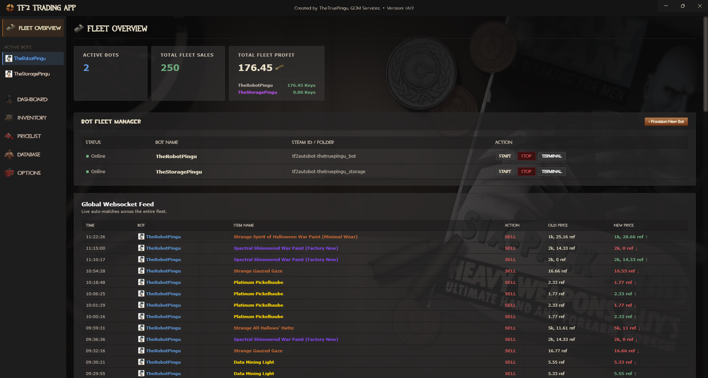

**Global Fleet Analytics:** Aggregates real-time statistics (Active Bots, Total Fleet Sales, Total Fleet Profit) across all operational bots, dynamically converting metal margins into Ref/Key approximations based on live market key prices.

**Bot Partition Generator:** A built-in quality-of-life tool that allows you to instantly spin up new bots. Submitting Steam Credentials through this GUI automatically clones internal templates, generates necessary `.env` files, and injects them into the fleet without the user ever touching a text editor.

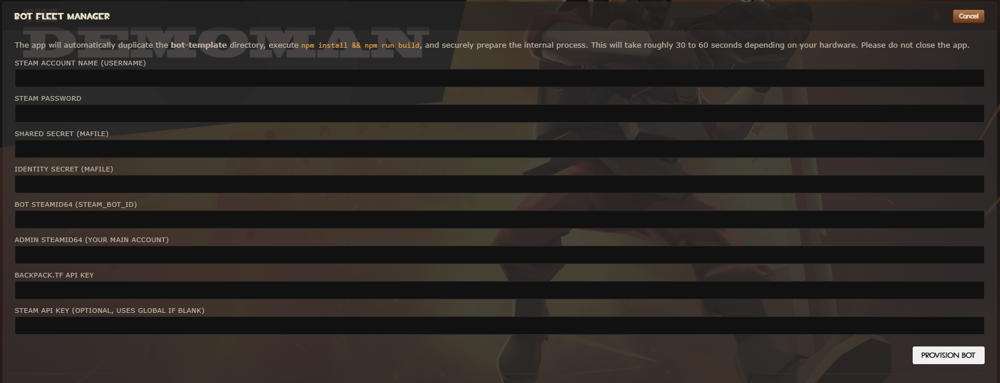

**Global WebSocket Feed:** Provides a live, unified data stream monitoring the automatic market price-matching across every bot in the fleet, highlighting buy/sell intent and margin shifts.

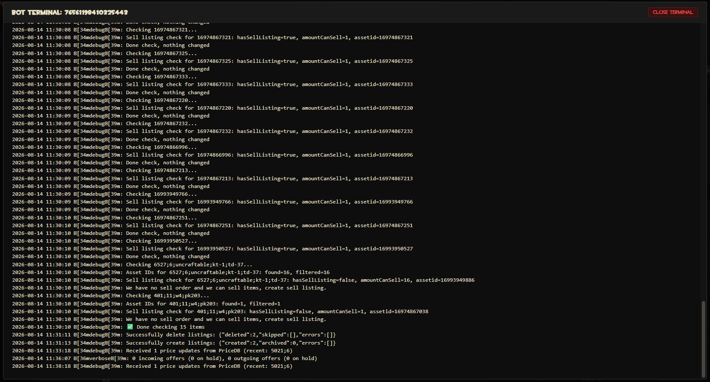

**Process Manager:** Used to start, stop, and view the live terminal command line outputs for any specific bot directly within the Electron UI.

## Bot Dashboard

The bot dashboard provides metrics for a single selected bot. It links directly to the fleet manager by isolating the data feed, allowing you to monitor API health, review recent trade offers, and track daily profit charting for specific accounts without background noise.

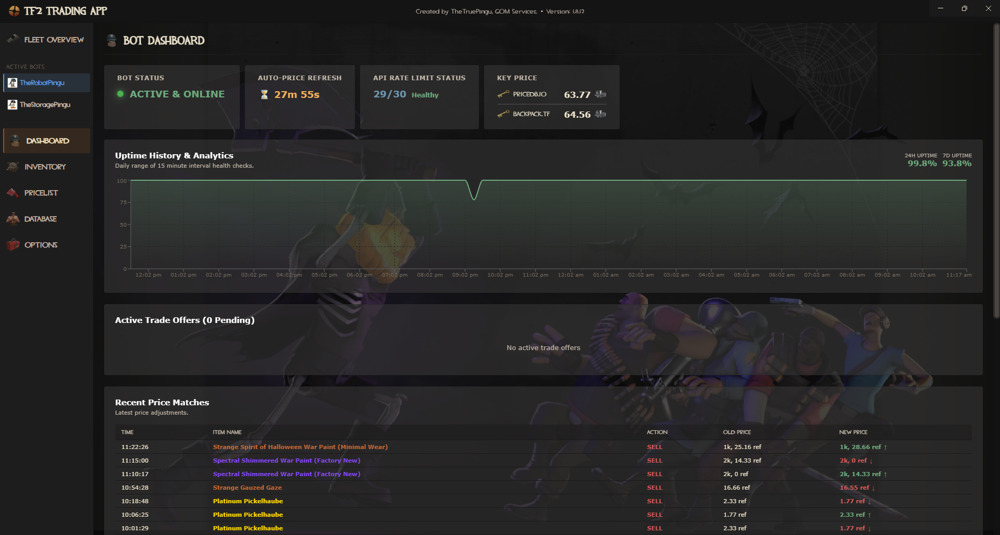

**Status Indicator:** provides live API polling for Backpack.tf and Steam Services connection health.

**Key Price:** Provides a semi-frequently called price from Pricedb.io which represents a more current value of the key, whilst the Backpack.tf voted price provides the latest accepted suggested price.

**Uptime History:** Using Recharts, shows the uptime of the selected bot for the past 24 hours, at 15 minute intervals. Using an averaging calculating to create a smooth graphical representation.

**Last Accepted Offer:** A display logging the latest accepted or declined trade offer, complete with timestamped hover-data and reason for decline/accept.

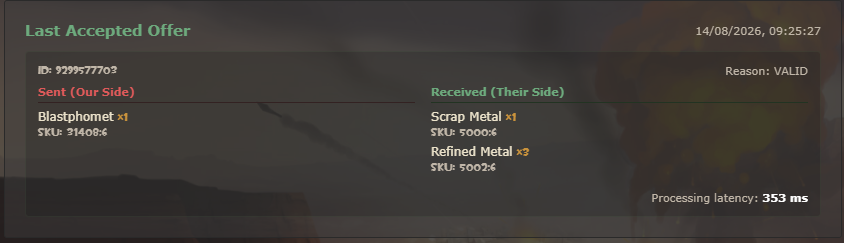

## Inventory Viewer

This tool visually recreates the selected bot's TF2 Backpack. By synchronizing with the local memory cache established by the fleet manager, it provides instant load times and overlays key item traits, ensuring you always know exactly what stock is available for the Pricelist Manager to utilise.

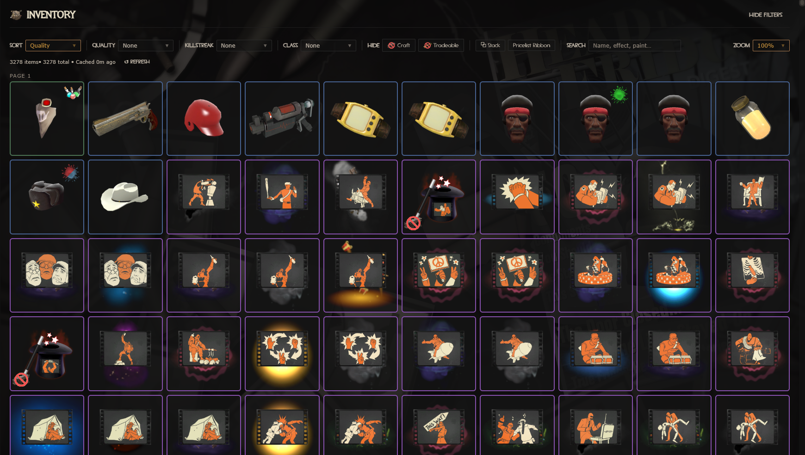

**State-Sync Caching:** Reads directly from the bot's memory/disk cache to provide instantaneous load times without hammering the Steam API, auto-refreshes after 5 minutes of inactive cache.

**Pricelist Ribbons & Stacking:** Toggleable buttons to add pricelist ribbons to the bottom left corner of the item tiles, indicating if the item is located on the pricelist. Stacking allows items of the same SKU and no differing attributes to be stacked onto a single item tile.

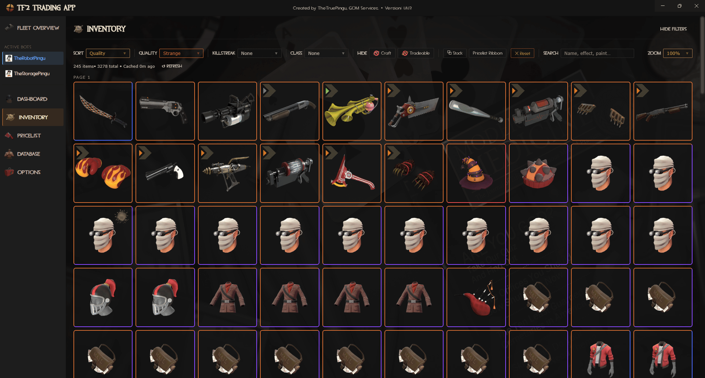

**Item Badges & Traits:** Overlays item attributes directly onto the UI tiles (e.g., painted colors, spelled attributes, craft numbers, and unusual effect icons).

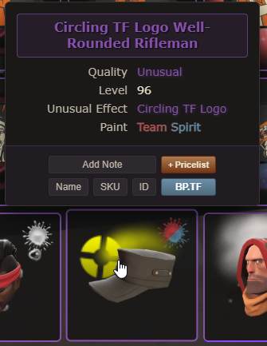

**Item Tooltip:** Provides detailed information about the items attributes, with custom colouring for paints, killstreak sheens, and item qualities. Provides the ability to add item-specific notes, copy the full item name, SKU, and item ID of the hovered item tile.

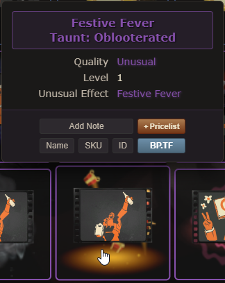

**Direct-to-Pricelist Buttons:** A button to directly move the item to the pricelist manager page whilst automatically filling the SKU to allow smooth, quick listing of items. Moves back to the position you were located after completing the pricelist entry.

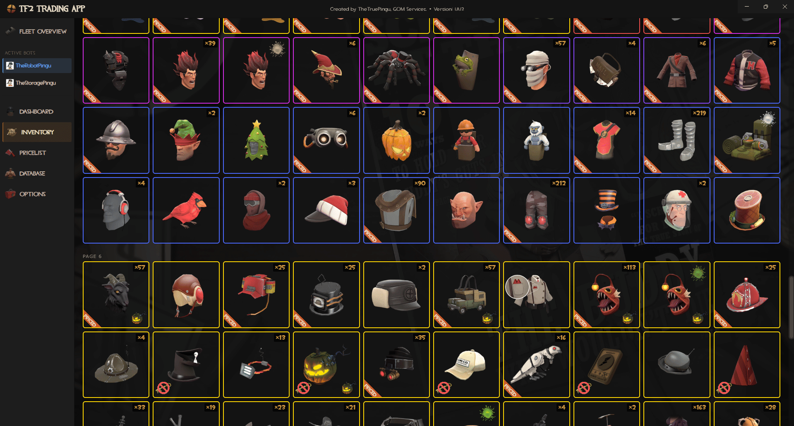

**Backpack.tf Stat Buttons:** Within the tooltip, there is a button dedicated to reviewing the backpack.tf stat page of the item hovered over.

**Filtering, Sorting, and Searching:** Class, qualities, tradability and craftability and name and description searching are all included in the inventory viewer. You can also toggle the filter bar as well to hide it if you find it unnecessary.

## Pricelist Manager

The pricelist page acts as the listing management core of your bot. It will dictate the trading behaviors of your bot by converting raw item names into their respective SKUs and feeding automated buy/sell orders directly into the bot's internal systems. Changes made here immediately influence the global websocket feed and the bot's market presence.

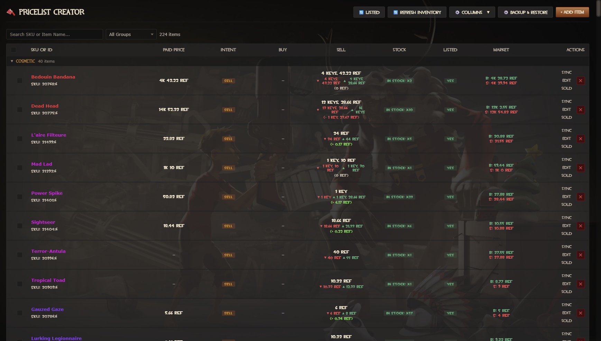

**SKU Parsing & Auto-Matching:** Converts raw item names into SKU strings and synchronises directly with the bot's internal `pricelist.json`.

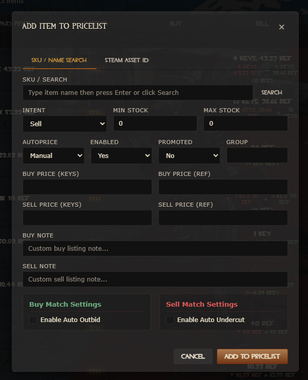

**Dynamic Table & Columns:** Houses an updating and customisable pricelist table that provides all information needed about each item, including the SKU, Paid Prices, Intent, Autopriced State, Min/Max Stock, Buy / Sell price (currently), Stock, Listed State, Enabled State and Market Values. All able to be toggled off/on when not needed.

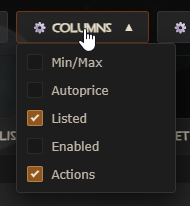

**Pricelist Sorting and Grouping:** Items are sorted top to bottom by their Graded value (Elite -> Civilian), then by Quality, then by Name (A -> Z). Pricelist grouping is set by the created pricelist.json listing group, being able to select to view only specific groups, and hiding/unhiding them via dropdown buttons.

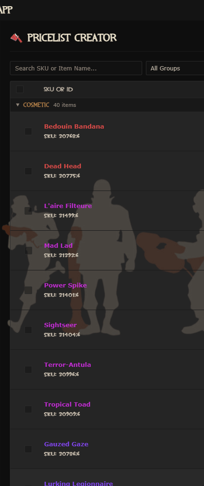

**Indepth Listing Menu:** Adding items to the pricelist opens an indepth GUI that allows the user to enter the SKU/Item Name/Item ID and automatically view if they have the item, how many they have, their paid price (if the SKU matches a Paid Prices entry), and if the item is already on the pricelist. Users can select Intent, their min and max stock, if its autopriced, enabled, or promoted, what group it is in (saves previously made groups), their buy/sell prices in keys & metal, and any custom notes.

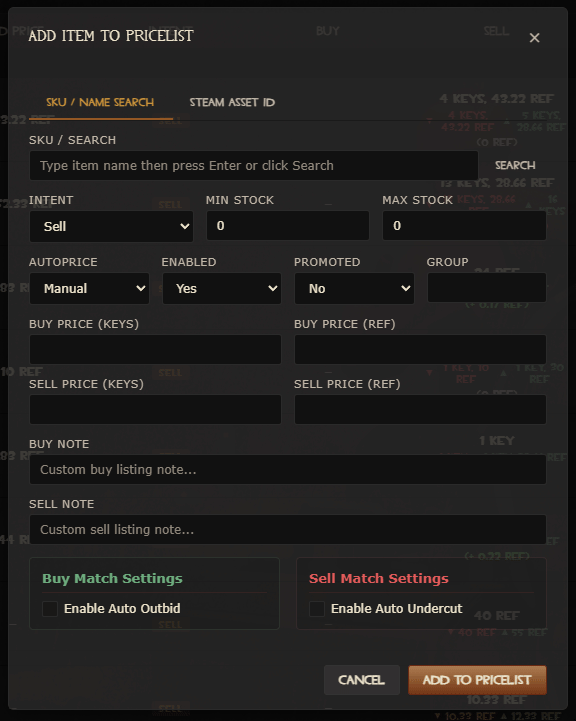

**Listing Auto Outbid & Auto Undercut:** The final part of the Listing GUI is the Buy / Sell Match settings, auto-off by default, these allow the user to set bounds that the listing will stay within and how much they want to beat the compititon by (default is zero scrap). Works off the internal WebSocket system, that reads from the WebSocket for only items on the pricelist, matches them up with recent sellers/buyers and then beats them.

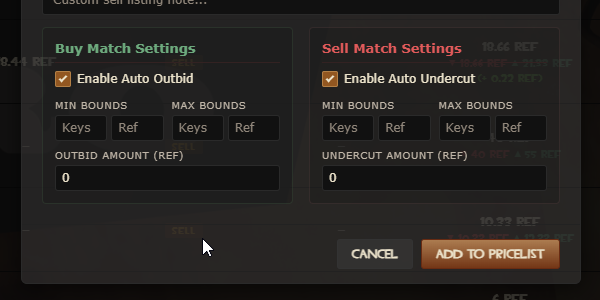

**Item Listing/WebSocket Data:** After clicking an entry on the pricelist, a dropdown menu will appear providing information on the recent buy and sell orders compiled via WebSocket data as well as the recent changes made to the price of the item based on those collected listings.
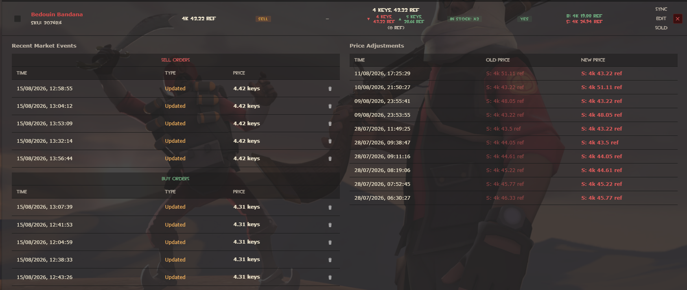

## Database Viewer

The database page interfaces with the isolated SQLite database generated for each bot. It allows you to search historical trade data, track profit margins on an item-by-item basis, and cross-reference past partners, providing the raw data needed to make informed pricing decisions in the Pricelist Manager. Additionally allows the control of blocked competitors or listings, and provides more information on Websocket data.

**Data Safety & Backup:** As apart of the mission to provide the most safe, local option available for TF2 trading, the ability to backup (export), import, and save your data from the Database pages has been integated within each page via a button on the top-right. This opens up a menu to choose what you want to proceed with.

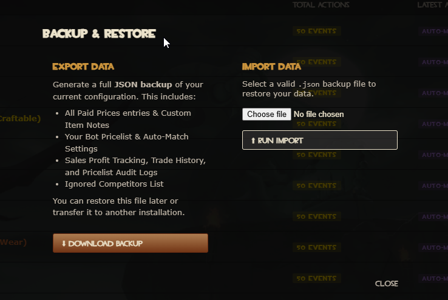

**Trades Page:** Provides information about the selected bots trades, split into months that can be navigated via arrow buttons at the top and bottom of the trade history table. At the top of the Trade page is the total trades, accepted trades, and profits. Next to this is a Rechart graph showing the day-to-day trading statistics, represented as column graphs for the trades and accepted trades and a calculated line graph for key profits.

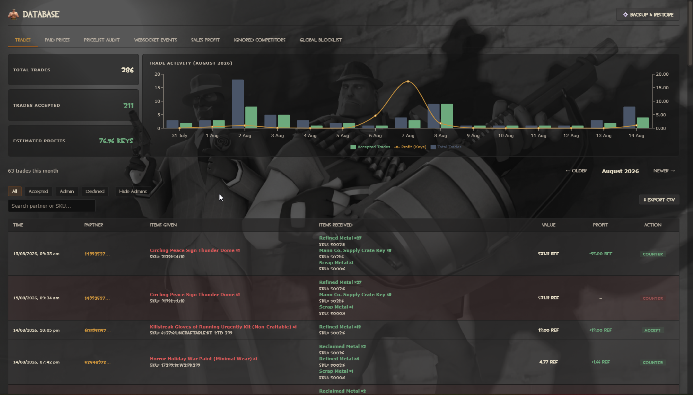
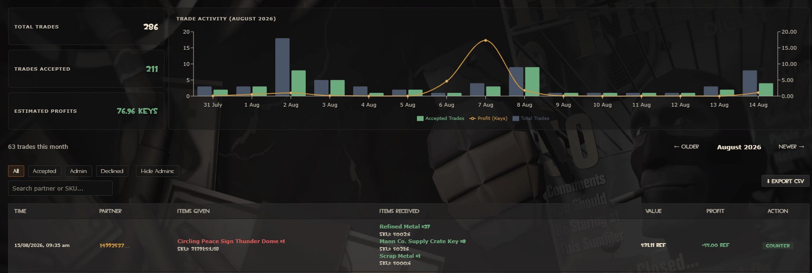

**Paid Prices Page:** A large, expandable database of the paid prices made by your bot, or yourself. Automatically added to, and averaged for buy/bank intent items, and used for calculating profits for Trades and Profit database pages. Seperated into bot and personal items, this allows immediate differentiation and tracking of trading items and to keep items. Uses the same SKU to Name (and vis versa) entry system that the pricelist has.

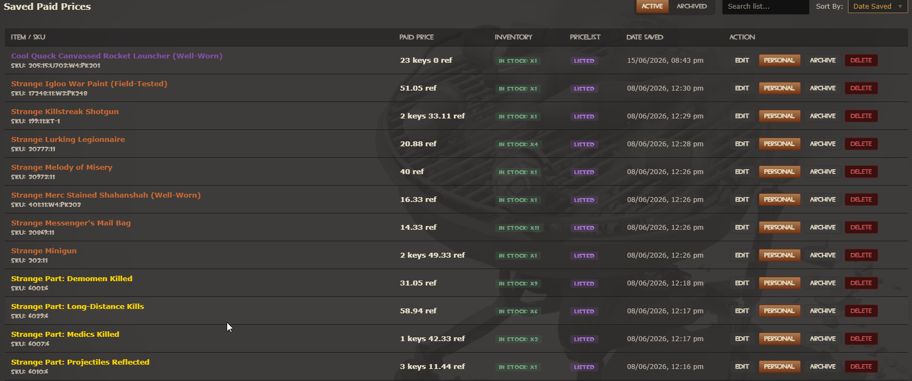
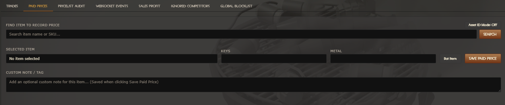

**Pricelist Audit Page:** Displays the last 50 updates for items in the pricelist, limited to 50 for performance purposes. Items placed on the pricelist will save to this section when updated, and once removed from the pricelist, the pricelist audits will be purged to save space and memory. Opening an entry provides further data on each pricelist audit change.

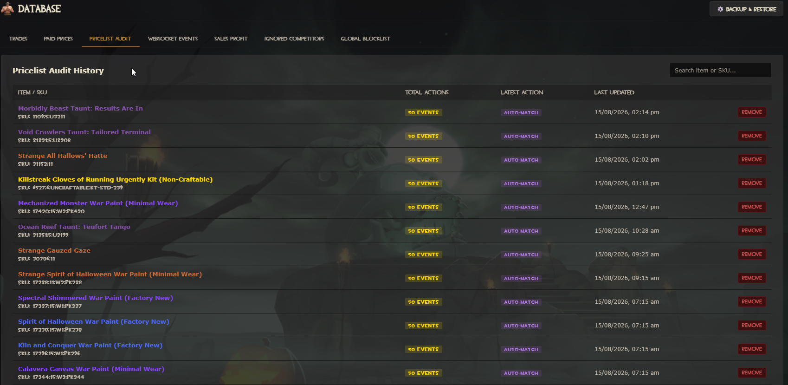
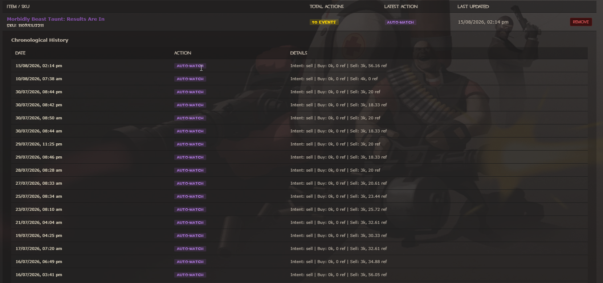

**WebSocket Events Page:** A table displaying WebSocket events captured for items on the pricelist, clicking them creates a dropdown displaying more details about each WebSocket Event.

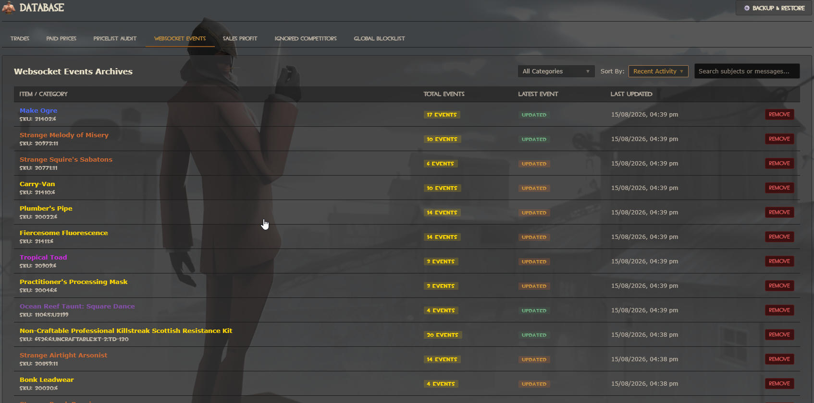
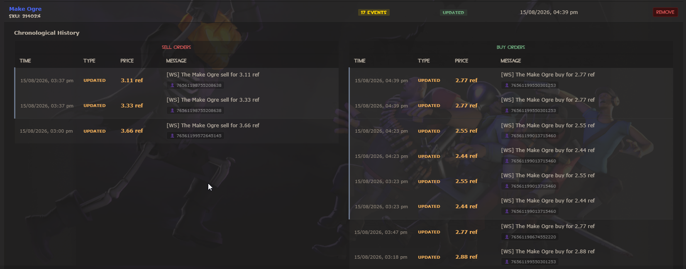

**Sale Profits Page:** Tracking profits from sales, automated and manually added trades. Displayed via Rechart and seperated by months. You can remove entries incase of errors.

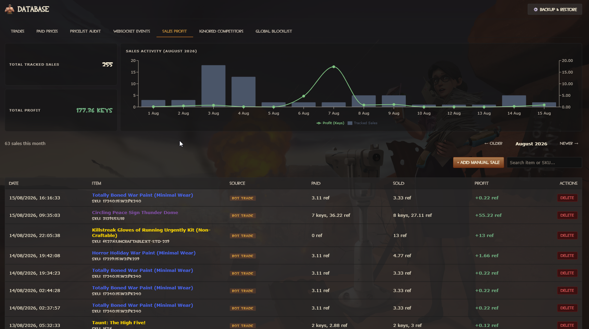
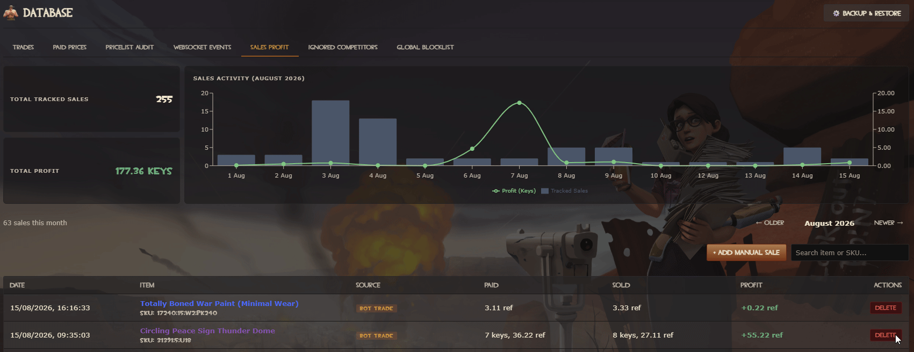

**Global Blocklist and Ignored Listings:** People are always the issue, with this tool, you can block individual listings, or ignored all listings from specific user steam IDs that love to spam listings to clog up your listing rate limit.

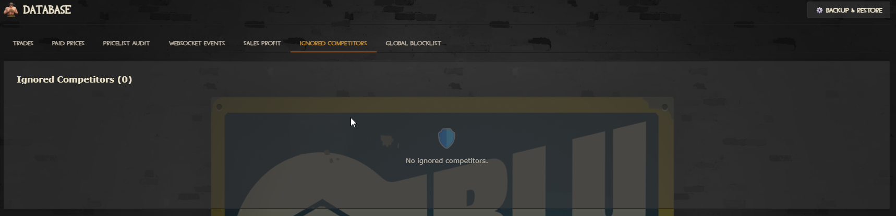
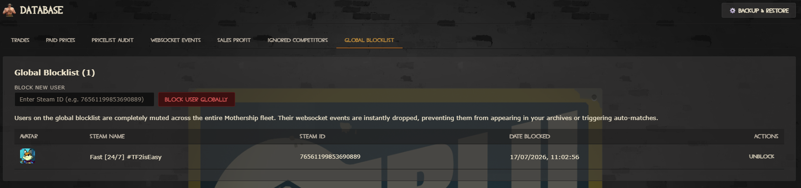

## Settings & Customization

This section manages the visual and operational preferences of the application. Changes here alter the global UI state, such as background branding and opacity, and allow you to assign specific colors to bots for easier identification across the Fleet Overview and Dashboard pages.

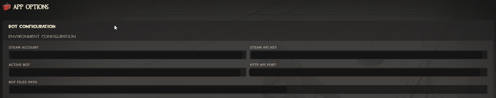
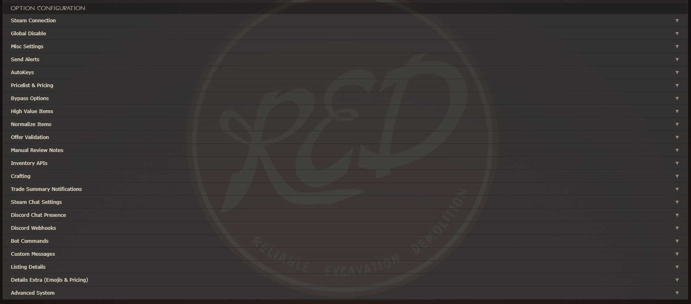
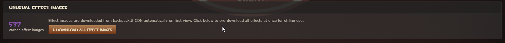

**Background Art & Adjustable UI:** Users can select between multiple, cycling background art pieces sourced locally from the `app_resources` folder, or force a single static image. Allows adding of your own background art if desired. Adjustable opacity sliders to adjust UI and Inventory Item Tiles of the panels.

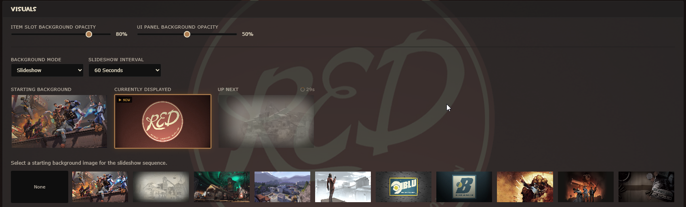

**Bot Customization:** Ability to assign specific HEX colors to specific bots, making it easier to track individual bot metrics on global dashboards. Allows toggling display name over steam account name.

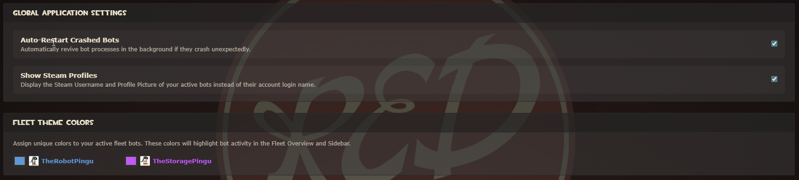

## Automatch System

A core component of the GOM Trading App is its collection and usage of WebSocket data to intelligently track incoming and outgoing listings.

**Collection:** The WebSocket is connected to through a WebSocket Hub script running on a child node process, this acts as a single connection, following the usage rules of backpack.tf's WebSocket server. They are then sent to each connection to be sorted.

**Sorting:** The events gathered through the WebSocket Hub are rapidly sorted and compared to SKU's on the active bot's pricelist, any events that match are stored and held for the next packet to the bot. Any unmatched events are discarded for the purpose of this application. There are a few selective rules that come along with the SKU matching system:

- Painted unusuals are included in automatching for their unpainted counterparts, stripping their paint partial SKU to achieve this.

- Painted and spelled hats in buy orders are filtered out when matching non-unusual items.

- Listings from Blocked Competitors or Ignored Listing IDs are excluded.

**Usage:** The bots will compare the new events to the old ones they have, with the intent (buy/sell), and event type (added, updated, removed) determining the usage.

- If the event is added, then it will be saved to the items (on the pricelist) WebSocket data.

- If the event is updated, it will be compared to saved WebSocket data, and replace the correct listing ID.

- If the event is removed, it will be compared to the saved WebSocket data, and remove the correct listing ID.

In the event there is a **Ghost Listing**, meaning a Listing that hasn't been bumped, updated, or removed in a certain amount of time, the automatching system to will flag and remove it from the used listings.

**Price Matching:** After adding, updating, or removing the listing data, the automatch system will check if the listed price (from the bot) is the lowest, if so, it will match to the next highest listing. This prevents individuals from pushing your price down to a large discount, then throwing their prices back up, this system catches those individuals and will prevent that from accuring.
